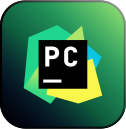

### Hi there 👋

I'm Roman, a software engineer mainly interested in programming languages tooling creation.

Actively contributing to different developer tools in my spare time.

---

  
<b>My Skill Set</b>

    <table>
        <tr>
            <td>
                <h3 align="center">Software</h3>
            </td>
            <td>
                <h3 align="center">Frontend</h3>
            </td>
            <td>
                <h3 align="center">Backend</h3>
            </td>
            <td>
                <h3 align="center">DevOps</h3>
            </td>
        </tr>
        <tr>
            <td width="25%">
                

                    
                    
                    
                    
                    
                

            </td>
            <td width="25%">
                

                    
                    
                    
                    
                

            </td>
            <td width="25%">
                

                    
                    
                    
                    
                    
                    
                

            </td>
            <td width="25%">
                

                    
                    
                    
                    
                

            </td>
        </tr>
    </table>  

  
<b>GitHub Stats</b>

  

    
    
  
  

    
<b>Connect with me</b>

    

      
      
        
    

